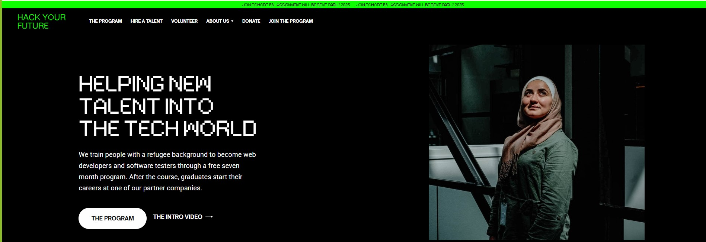

# Hack Your Future

Hack Your Future is a non-profit organization that provides web development and
software testing training for people with refugee backgrounds. The program helps
students build skills through a structured curriculum and connects them with
partner companies for internships and job opportunities, promoting inclusion in
the tech industry.

## Table of contents

- [Hack Your Future](#hack-your-future)
  - [Table of contents](#table-of-contents)
  - [General info](#general-info)
  - [Screenshots](#screenshots)
  - [Technologies](#technologies)
  - [Code Examples](#code-examples)
  - [Status](#status)
  - [Contact](#contact)
  - [Instructions for use](#instructions-for-use)
  - [Code Quality Checks](#code-quality-checks)
  - [Continuous Integration (CI)](#continuous-integration-ci)
  - [Repo Setup](#repo-setup)

## General info

> Non-profit organization that provides web development

## Screenshots



## Technologies

- Node v20.17.0
- VSC code
- HTML
- CSS

## Code Examples

```html
    <div class="section-large bg-dark">
      <div class="main-container">
        <div class="w-layout-grid grid-halves-2 cta-grids">
          <div id="w-node-_7d4e2d9c-0673-808d-9777-237fbb1d9eb9-4602e65a" class="div-block-2">
            <h4 id="w-node-_42547756-ec02-6030-c077-964b8affc923-4602e65a" class="large-heading-2">&lt;BEING&nbsp;A
              REFUGEE<br>WASN'T&nbsp;THEIR&nbsp;<br>CHOICE&gt;<br>&lt;BECOMING&nbsp;A<br>DEVELOPER&nbsp;WAS&gt;</h4>
          </div>
          <div id="w-node-_55736706-7341-5a6c-3164-f2984e8b1134-4602e65a" class="div-block">
            <p class="text-block-3 center">Six years ago, HackYourFuture was founded to tackle the challenging
              un(der)employment of people with a refugee background, while addressing the ever-growing demand for tech
              talent. We have helped over 300 of our graduates in the Netherlands, and over 600 worldwide, into
              meaningful, high-quality jobs.</p>
            <div class="button-pair"><a href="/about" class="button large bg-white w-inline-block">
                <div class="text-block-6">About us</div>
              </a><a href="/donate" class="link-with-arrow beside-button w-inline-block">
                <div class="uppercase-white text-white">SUPPORT&nbsp;OUR&nbsp;MISSION</div>
              </a></div>
          </div>
```

## Status

Project is: _completed_

## Contact

By

- [Emilia](https://github.com/emilia-12)
- [Semen](https://github.com/bynd1u)
- [Viktoriia](https://github.com/ViktoriiaMessi)
- [Mohammed](https://github.com/Mohammed-ABR)

## Instructions for use

<details>
  <summary>Getting Started</summary>

<!-- a guide to using this repository -->

1. `git clone git@github.com:HackYourFutureBelgium/template-markdown.git`
2. `cd template-markdown`
3. `npm install`

## Code Quality Checks

- `npm run format`: Makes sure all the code in this repository is well-formatted
  (looks good).
- `npm run lint:ls`: Checks to make sure all folder and file names match the
  repository conventions.
- `npm run lint:md`: Will lint all of the Markdown files in this repository.
- `npm run lint:css`: Will lint all of the CSS files in this repository.
- `npm run validate:html`: Validates all HTML files in your project.
- `npm run spell-check`: Goes through all the files in this repository looking
  for words it doesn't recognize. Just because it says something is a mistake
  doesn't mean it is! It doesn't know every word in the world. You can add new
  correct words to the [./.cspell.json](./.cspell.json) file so they won't cause
  an error.
- `npm run accessibility -- ./path/to/file.html`: Runs an accessibility analysis
  on all HTML files in the given path and writes the report to
  `/accessibility_report`

## Continuous Integration (CI)

When you open a PR to `main`/`master` in your repository, GitHub will
automatically do a linting check on the code in this repository, you can see
this in the[./.github/workflows/lint.yml](./.github/workflows/lint.yml) file.

If the linting fails, you will not be able to merge the PR. You can double check
that your code will pass before pushing by running the code quality scripts
locally.

## Repo Setup

- Give each member **_write_** access to the repo (if it's a group project)
- Turn on GitHub Pages and put a link to your website in the repo's description
- Go to _General_ Section > check **Discussions**
- In the _Branches_ section of your repo's settings make sure the
  `master`/`main` branch must:
  - "_Require a pull request before merging_"
  - "_Require approvals_"
  - "_Dismiss stale pull request approvals when new commits are pushed_"
  - "_Require status checks to pass before merging_"
  - "_Require branches to be up to date before merging_"
  - "_Do not allow bypassing the above settings_"

</details>
