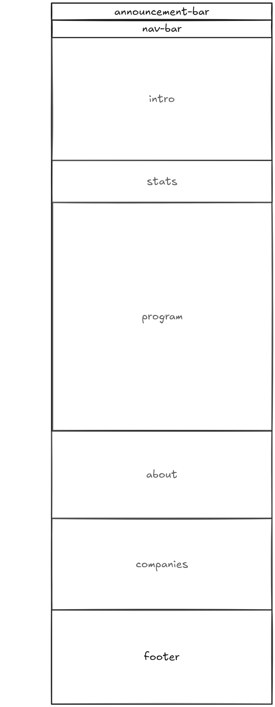

# Design

---

## Project's design overview

• Colors: Black (elegant background), bright green (highlight and tech feel),
white and gray (clarity and contrast). • Fonts: Modern and simple, with large
headings and smaller secondary text. • Overall Design: Organized, modern, with
human images to add a personal touch. • Layout: Clear and balanced sections for
easy readability. • Interactive Texts: Highlighted in green to grab attention.

## Project's design

---

<!-- give an overview of your project's design -->
<!-- describe the reasoning behind your group's design and wireframe -->
<!-- include other centralized decisions like fonts, palates, ... -->

---

## Wireframe(s)

---

<!-- provide a link to your wireframe documenting on Figma, or wherever it is -->
